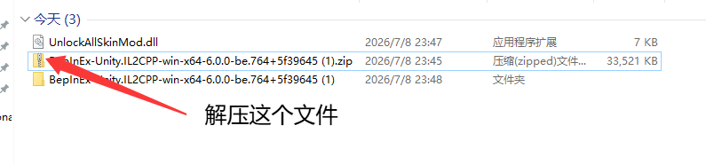
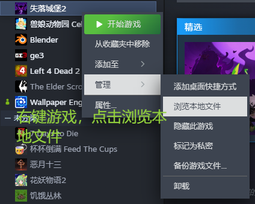
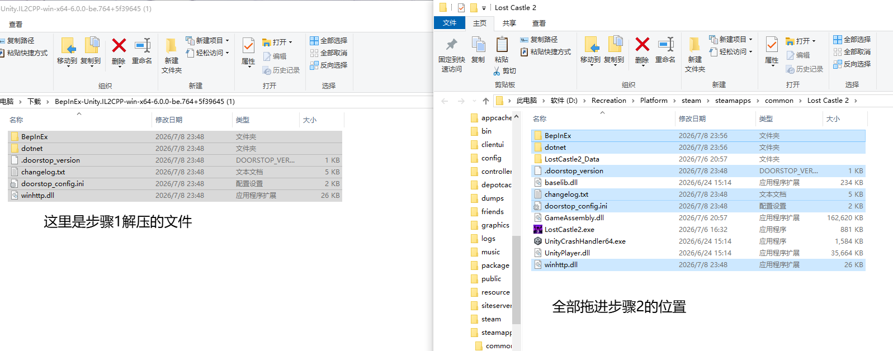
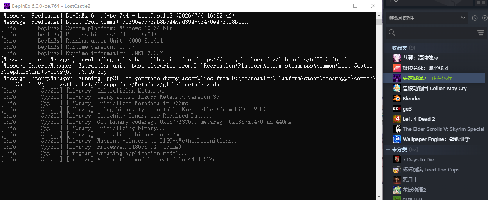
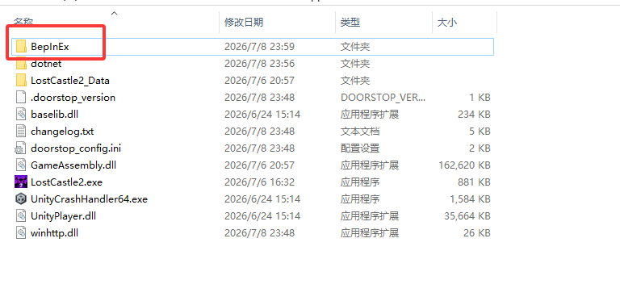
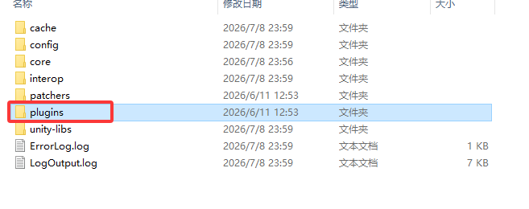
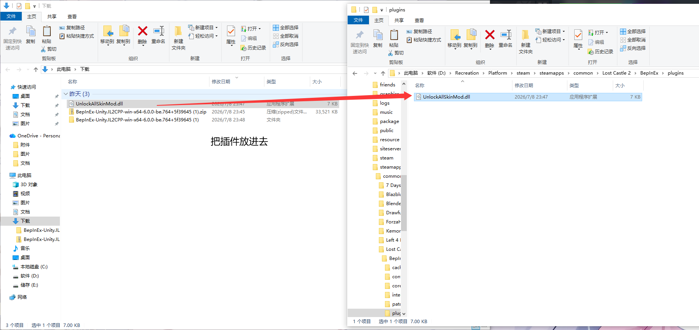
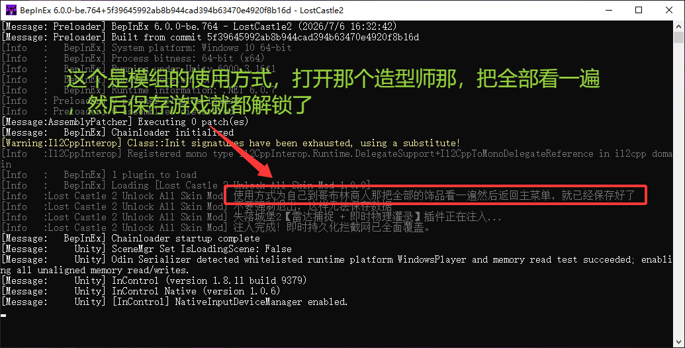

# 失落城堡2 全皮肤解锁 MOD 使用教程

本教程用于指导如何安装《失落城堡2》全皮肤解锁插件。

> **提示**
> 安装完成后，进入游戏打开“哥布林造型师”，将每个皮肤都浏览一遍。保存并退出游戏后，即可删除该 MOD，皮肤将保持永久解锁状态。

## 视频使用教程

> 下面有详细的安装教程，先看下面的安装教程再看使用教程

[点击观看演示视频](https://www.bilibili.com/video/BV19GTt6WEHY/)

---

## 一、文件下载

请下载以下两个必要文件：

* [插件下载 (UnlockAllSkinMod.dll)](https://github.com/efghsgt/UnlockAllSkin_Lost_Castle_2/releases/download/beplnex6%E7%9A%84%E5%8A%9F%E8%83%BDmod/UnlockAllSkinMod.dll)
* [基础框架 (BepInEx 6)](https://builds.bepinex.dev/projects/bepinex_be/764/BepInEx-Unity.IL2CPP-win-x64-6.0.0-be.764%2B5f39645.zip)

---

## 二、安装步骤

### 1. 解压框架
下载完成后，解压基础框架的 `.zip` 压缩包。

### 2. 打开游戏根目录
在 Steam 中右键点击《失落城堡2》，选择 **管理** -> **浏览本地文件**。

### 3. 放入框架文件
将解压出来的所有文件及文件夹，复制并粘贴到游戏的根目录下。

### 4. 初始化基础框架
启动一次游戏，进入游戏主界面后直接退出。此步骤用于自动生成插件目录。

### 5. 安装 MOD 插件
再次打开游戏根目录，依次进入 `BepInEx` -> `plugins` 文件夹。将下载的 `UnlockAllSkinMod.dll` 文件放入该文件夹内。

### 6. 运行游戏
重新启动游戏。

### 7. 解锁皮肤
进入游戏存档，找到“哥布林造型师”，依次查看每个皮肤，操作完成后保存存档即可。
